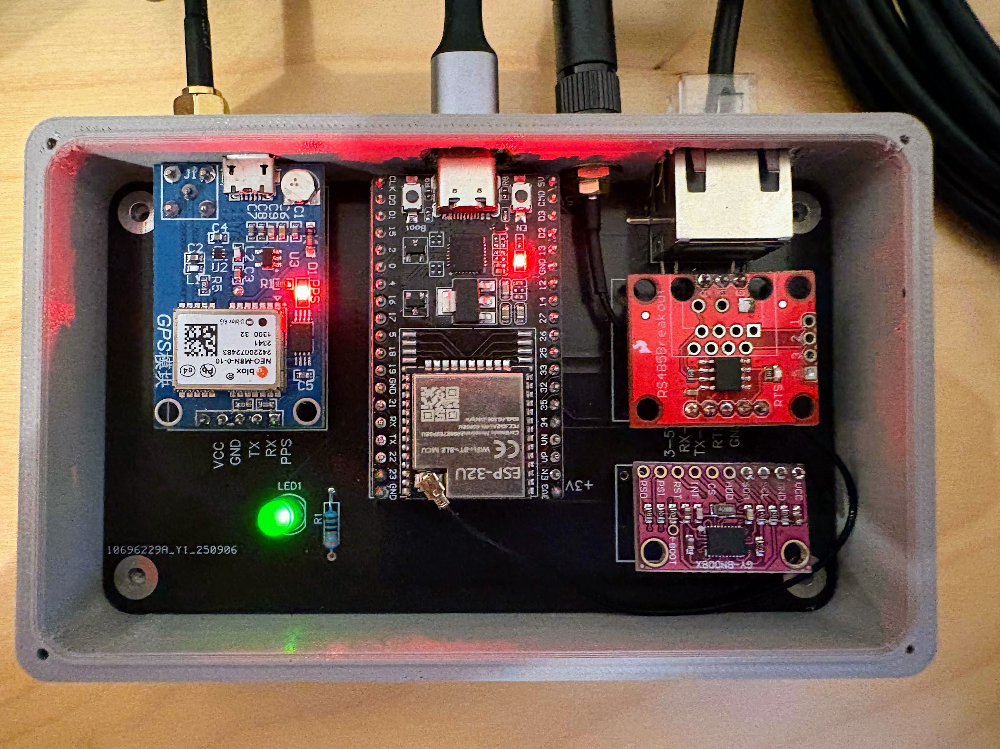

# Veetr - Hardware Documentation

Technical documentation for the ESP32-based sailing sensor hardware and dashboard integration.

## Hardware Overview

The Veetr uses an ESP32 microcontroller with multiple sensors to provide comprehensive sailing data via Bluetooth Low Energy (BLE) to a web-based dashboard.



## Modular Design Philosophy

Veetr employs a **modular breakout board architecture** for maximum flexibility and maintainability:

### 🔧 Design Benefits
- **Standard Components**: All sensors are off-the-shelf modules with pin headers
- **Easy Replacement**: Swap faulty sensors without system redesign  
- **Future-Proof**: Upgrade individual sensors as technology improves
- **Cost-Effective**: No custom sensor manufacturing required
- **Repair-Friendly**: Replace only broken components
- **Expandable**: Add new sensors by updating firmware and PCB layout ([PCB files available](../pcb/))

### 🔌 Connection Method
- **Pin Headers**: Standard 2.54mm pitch pin headers for all connections
- **Breadboard Compatible**: Prototype on breadboard before PCB assembly ([Gerber files for manufacturing](../pcb/gerbers/))
- **Modular Cables**: Use DuPont cables for temporary connections

## Note on Affiliate Links
Some of the parts listed below use affiliate links. If you choose to purchase through these, a small portion comes back to support the project’s ongoing development. This doesn’t change the price you pay. If you’d rather not use affiliate links, feel free to search for the part numbers directly (a quick Google search will usually turn them up).

## Hardware Components

### 🔧 Main Controller:

#### ESP32 DevKitC WROOM-32U Development Board
[](https://s.click.aliexpress.com/e/_onsyWtH)
- **Purchase Link:** https://s.click.aliexpress.com/e/_onsyWtH
- **Product Name:** ESP32 DevKitC WIFI+Bluetooth Development Board WROOM & WIFI Module with 2.4G Antenna Optional ESP32-WROOM-32U Development Board
- **Board Type:** ESP32 DevKitC WROOM-32U
- **Module:** ESP32-WROOM-32U (with external antenna connector)
- **Processor:** Tensilica Xtensa Dual-Core 32-bit LX6 microprocessor
- **Clock Speed:** Up to 240MHz (adjustable for power management)
- **Operating Voltage:** 3.3V (with onboard voltage regulator for 5V input)
- **Flash Memory:** 4MB (for firmware and file storage)
- **SRAM:** 520KB (for runtime variables and program execution)
- **Connectivity:**
  - Wi-Fi: 802.11 b/g/n (2.4 GHz) with external antenna connector - not used in this marine application
  - Bluetooth: v4.2 BR/EDR + BLE (using BLE for low power marine communication)
  - **External Antenna:** U.FL/IPEX connector for 2.4G antenna (recommended for marine use)
- **GPIO Pins:** 36 total pins (34 usable as GPIO)
- **ADC:** 12-bit resolution, 18 channels (for analog sensor reading)
- **DAC:** 8-bit resolution, 2 channels
- **Communication Interfaces:**
  - SPI: 4 interfaces (for high-speed sensor communication)
  - I2C: 2 interfaces (used for IMU sensor)
  - I2S: 2 interfaces (for audio applications)
  - UART: 3 interfaces (used for GPS and RS485 communication)
  - CAN: 1 interface
- **PWM:** 16 channels (software configurable)
- **Capacitive Touch:** 10 GPIO pins support touch sensing
- **Form Factor:** Breadboard-friendly with dual-row pin layout
- **USB Interface:** USB-C for programming and power
- **Power Management:** Onboard AMS1117 3.3V regulator
- **Reset/Boot:** Physical buttons for reset and flash mode
- **LED Indicators:** Built-in power and programmable LEDs
- **Marine Suitability:** Robust design suitable for marine electronics projects
- **Antenna Options:** Can be ordered with or without external 2.4G antenna (external antenna recommended for marine applications to improve BLE range and reliability)

#### ESP32 Pinout Reference
```
                    ESP32 DevKitC WROOM-32U
                   +--------------------+
              3V3 -|3V3              GND|- GND
              EN  -|EN               IO23|- IO23/VSPI_MOSI
              VP  -|IO36/VP         IO22|- IO22/I2C_SCL
              VN  -|IO39/VN         IO1 |- IO1/TX0
              IO34-|IO34            IO3 |- IO3/RX0
              IO35-|IO35            IO21|- IO21/I2C_SDA
              IO32-|IO32            GND |- GND
              IO33-|IO33            IO19|- IO19/VSPI_MISO
              IO25-|IO25            IO18|- IO18/VSPI_CLK
              IO26-|IO26            IO5 |- IO5/VSPI_CS
              IO27-|IO27            IO17|- IO17
              IO14-|IO14/HSPI_CLK   IO16|- IO16
              IO12-|IO12/HSPI_MISO  IO4 |- IO4
              GND -|GND             IO0 |- IO0
              IO13-|IO13/HSPI_MOSI  IO2 |- IO2
              SD2 -|SD2             IO15|- IO15/HSPI_CS
              SD3 -|SD3             SD1 |- SD1
              CMD -|CMD             SD0 |- SD0
              5V  -|5V              CLK |- CLK
                   +--------------------+
                         USB-C PORT
```

#### Pin Categories
| Pin Category | Pin Numbers | Description |
|--------------|-------------|-------------|
| Power Pins | 3V3, 5V, GND | 3.3V and 5V power outputs, Ground pins |
| ADC Pins | IO32-IO39, IO0-IO5 | Analog-to-Digital Converter |
| DAC Pins | IO25, IO26 | Digital-to-Analog Converter |
| Touch Pins | IO0, IO2, IO4, IO12-IO15, IO27, IO32, IO33 | Capacitive touch sensors |
| SPI Pins | VSPI: IO5(CS), IO18(CLK), IO19(MISO), IO23(MOSI)<br>HSPI: IO15(CS), IO14(CLK), IO12(MISO), IO13(MOSI) | Serial Peripheral Interface |
| I2C Pins | IO21(SDA), IO22(SCL) | Inter-Integrated Circuit |
| UART Pins | UART0: IO1(TX), IO3(RX)<br>UART1: IO9(TX), IO10(RX)<br>UART2: IO16(TX), IO17(RX) | Serial communication |
| PWM Pins | All GPIOs | Pulse Width Modulation (software configurable) |

### 📡 Sensors:

#### 1. GY-BNO080 BNO085 AR VR IMU High Accuracy Nine-Axis 9DOF AHRS Sensor Module
[](https://s.click.aliexpress.com/e/_okDR7nd)
- **Purchase Link:** https://s.click.aliexpress.com/e/_okDR7nd
- **Model:** GY-BNO080 BNO085 AR VR IMU High Accuracy Nine-Axis 9DOF AHRS Sensor Module
- **Chipset:** Bosch BNO080 9-axis IMU with integrated sensor fusion
- **Interface:** I2C (primary) and SPI support
- **Sensors Integrated:**
  - **3-axis Accelerometer:** ±2g, ±4g, ±8g, ±16g selectable range
  - **3-axis Gyroscope:** ±250, ±500, ±1000, ±2000 dps selectable range
  - **3-axis Magnetometer:** Built-in compass functionality
- **Sensor Fusion:** Hardware-based AHRS (Attitude and Heading Reference System)
- **Output Data:**
  - Absolute orientation (quaternions, Euler angles)
  - Linear acceleration (gravity compensated)
  - Angular velocity
  - Magnetic heading
  - Calibrated sensor data
- **Resolution:** 16-bit for all sensors
- **Update Rate:** Up to 1000Hz (configurable, typically 100Hz for marine use)
- **Operating Voltage:** 3.3V (ESP32 compatible)
- **Current Consumption:** ~12.3mA typical operation
- **Temperature Range:** -40°C to +85°C (marine environment rated)
- **Calibration:** Automatic dynamic calibration with calibration status reporting
- **Marine Advantages:**
  - Single-chip solution eliminates sensor synchronization issues
  - Hardware sensor fusion provides stable, drift-free orientation
  - Built-in calibration algorithms for magnetic interference compensation
  - High accuracy suitable for precision sailing applications
- **Applications in this project:**
  - Real-time boat roll, pitch, and yaw measurement
  - Magnetic heading (compass) with automatic calibration
  - Heeling angle calculation for sailing optimization
  - Stability monitoring and motion analysis
  - True wind calculation support with attitude compensation

#### 2. RS485 Wind Sensor
[](https://s.click.aliexpress.com/e/_onkySgT)
- **Purchase Link:** https://s.click.aliexpress.com/e/_onkySgT
- **Model:** Ultrasonic wind speed and direction sensor Miniature size Output RS485 Power supply 5 ~ 12V DC
- **Design:** Miniature size for compact marine installations
- **Interface:** RS485 Modbus RTU protocol
- **Communication:** Half-duplex serial communication at 9600 baud
- **Measurements:**
  - Wind Speed: 0-30 m/s (0-60 knots) ±0.3 m/s accuracy
  - Wind Direction: 0-359° ±3° accuracy
- **Update Rate:** 1-10 Hz configurable (1 second default for marine stability)
- **Operating Voltage:** 5-12V DC (lower power requirement than standard models)
- **Power Consumption:** <1W typical operation (energy efficient for marine use)
- **Operating Temperature:** -40°C to +80°C (marine grade)
- **Protection Rating:** IP65 (weather resistant for marine mounting)
- **Size Advantage:** Miniature design reduces wind resistance and installation complexity
- **Installation:** Masthead or deck mounting with clear 360° exposure
- **Cable Length:** Up to 1000m RS485 transmission distance
- **Applications in this project:**
  - Real-time apparent wind speed and direction
  - True wind calculation with GPS speed and heading
  - Wind trend analysis and logging
  - Sailing performance optimization data

#### 3. GPS Module
[](https://s.click.aliexpress.com/e/_onLOZmT)
- **Purchase Link:** https://s.click.aliexpress.com/e/_onLOZmT

[](https://s.click.aliexpress.com/e/_oExx7iF)
- **Antenna** https://s.click.aliexpress.com/e/_oExx7iF

- **Model:** GY-NEO8MV2 Module with Flight Control EEPROM MWC APM2.5 Large Antenna
- **Chipset:** u-blox NEO-8M GNSS receiver
- **Interface:** UART serial communication (3.3V/5V compatible)
- **Antenna:** Large ceramic patch antenna for enhanced reception
- **EEPROM:** Built-in configuration storage for flight control applications
- **Data Format:** NMEA 0183 standard sentences (GGA, RMC, VTG, etc.)
- **Update Rate:** 1-10 Hz configurable (default 1Hz)
- **Accuracy:** <2.5 meters CEP (Circular Error Probable)
- **Sensitivity:** -167 dBm (excellent for marine conditions)
- **Acquisition:** Cold start <29s, Hot start <1s
- **Operating Voltage:** 3.3V-5V (ESP32 compatible)
- **Current Consumption:** ~45mA active, ~20mA backup mode
- **Temperature Range:** -40°C to +85°C (marine environment rated)
- **Supported Systems:** GPS, GLONASS, Galileo, BeiDou
- **Applications in planned features:**
  - Speed over ground (SOG) with high precision
  - Course over ground (COG) for navigation
  - Position fixing and track logging
  - True wind calculation with GPS speed compensation
  - Waypoint navigation and routing
  - Anchor drag alarm functionality
  - Time synchronization for data logging

### 🔌 Communication Modules:

#### RS485 to TTL Converter Module
[](https://www.aliexpress.com/item/32688467460.html)
- **Purchase Link:** https://www.aliexpress.com/item/32688467460.html
- **Model:** MAX485 or SP3485 based converter
- **Function:** Convert ESP32 UART signals to RS485 differential signals
- **Interface:** 
  - TTL Side: 3.3V/5V UART (RX, TX, DE/RE)
  - RS485 Side: A+/B- differential pair
- **Operating Voltage:** 3.3V to 5V (ESP32 compatible)
- **Data Rate:** Up to 2.5 Mbps (more than sufficient for 9600 baud wind sensor)
- **Protection:** Built-in ESD protection for marine environment
- **Connections to ESP32:**
  - VCC → 3.3V or 5V
  - GND → Ground
  - DI (Data Input) → ESP32 TX pin
  - RO (Receiver Output) → ESP32 RX pin
  - DE/RE (Driver Enable/Receiver Enable) → ESP32 GPIO control pin
- **Connections to Wind Sensor:**
  - A+ → Wind sensor A+ (positive differential)
  - B- → Wind sensor B- (negative differential)
  - GND → Wind sensor ground (if available)

## System Architecture

### Data Flow:
1. **Sensors** → **ESP32** (collect and process data)
2. **ESP32** → **BLE** (transmit via Bluetooth Low Energy)
3. **BLE** → **Web Dashboard** (display real-time data)
4. **Web Dashboard** → **BLE** → **ESP32** (configuration commands)

### Power Management:
- **Input**: 5V via USB or external power
- **Consumption**: ~200mA typical, ~400mA peak
- **Low Power Mode**: Available for battery operation
- **Battery Monitoring**: ADC input for battery voltage

## Technical Specifications

### ESP32 Configuration:
- **Platform**: Espressif32 v6.4.0+
- **Framework**: Arduino
- **Build Flags**: Size optimized (-Os), PSRAM enabled
- **Memory Usage**: 11.6% RAM, 52.1% Flash

### BLE Configuration:
- **Service**: Custom sailing data service
- **Characteristics**: Wind, GPS, IMU, battery, configuration
- **Connection**: Up to 4 simultaneous connections
- **Range**: ~10-50 meters (enhanced with external antenna)
- **Marine Optimization**: External antenna provides superior performance in marine environments

### Sensor Interfaces:
- **I2C**: IMU sensor (SDA: GPIO21, SCL: GPIO22)
- **UART**: GPS module (RX: GPIO16, TX: GPIO17)
- **RS485**: Wind sensor (DE/RE: GPIO14, RX: GPIO32, TX: GPIO33)
- **Discovery Button**: GPIO0 (Built-in BOOT button)
- **Status LED**: GPIO2 (Built-in LED)
- **Anchor Light LED**: GPIO25 (Masthead LED control)

## Installation and Wiring

### ESP32 Pin Connections:
```
ESP32 DevKitC WROOM-32U Pinout:
┌─────────────────────────────┐
│  3V3  [ ][ ] VIN            │
│  GND  [ ][ ] GND            │
│  TX2  [ ][ ] GPIO13         │
│  RX2  [ ][ ] GPIO12         │
│GPIO22 [ ][ ] GPIO14         │ ← I2C SCL (IMU) / RS485 DE/RE
│GPIO21 [ ][ ] GPIO27         │ ← I2C SDA (IMU)
│GPIO17 [ ][ ] GPIO26         │ ← UART TX (GPS)
│GPIO16 [ ][ ] GPIO25         │ ← UART RX (GPS)
│GPIO4  [ ][ ] GPIO33         │                   / RS485 TX
│GPIO0  [ ][ ] GPIO32         │ ← BOOT Button     / RS485 RX
│GPIO2  [ ][ ] GPIO35         │ ← Status LED
│GPIO15 [ ][ ] GPIO34         │
│GPIO8  [ ][ ] GPIO39         │
│GPIO7  [ ][ ] GPIO36         │
│GPIO6  [ ][ ] EN             │
│GPIO5  [ ][ ] 3V3            │
│  GND  [ ][ ] GND            │
└─────────────────────────────┘
```

### Sensor Wiring:

#### IMU Sensor (BNO080):
```
BNO080  →  ESP32
VCC     →  3.3V
GND     →  GND
SDA     →  GPIO21
SCL     →  GPIO22
```

#### GPS Module:
```
GPS     →  ESP32
VCC     →  3.3V or 5V
GND     →  GND
TX      →  GPIO16 (RX2)
RX      →  GPIO17 (TX2)
```

#### Wind Sensor (RS485):
```
RS485   →  ESP32
A+      →  GPIO33 (via RS485 transceiver)
B-      →  GPIO32 (via RS485 transceiver)
DE/RE   →  GPIO14
VCC     →  5-12V DC (5V power bank compatible)
GND     →  GND
```

## Development Environment

### Build Configuration:
- **Memory**: 38KB RAM, 683KB Flash used
- **Libraries**: All dependencies automatically managed
- **Build Time**: ~16 seconds for full build
- **Upload**: ~10 seconds via USB

### Development Tools:
- **VS Code** with PlatformIO extension
- **Task Buttons** for one-click build/upload
- **Serial Monitor** for debugging
- **Web Dashboard** for testing BLE communication

## Features Implementation

### Real-time Data Streaming:
- **GPS Data**: Position, SOG, COG, satellite count
- **Wind Data**: Apparent wind speed/direction, true wind calculations
- **Heel Data**: Roll, pitch, yaw from IMU sensor fusion
- **System Data**: Battery voltage, connection status, error states

### Device Configuration:
- **Sensor Calibration**: Wind direction offset, magnetic declination
- **Update Rates**: Configurable sensor polling intervals  
- **Device Settings**: BLE name, connection parameters
- **Factory Reset**: Restore all settings to defaults

### Error Handling:
- **Sensor Monitoring**: Automatic detection of failed sensors
- **Graceful Degradation**: Continue operation with available sensors
- **Status Reporting**: Error codes transmitted via BLE
- **Watchdog Timer**: Automatic recovery from system hangs

## Performance Specifications

### Data Rates:
- **GPS Updates**: 1Hz (configurable up to 10Hz)
- **IMU Updates**: 10Hz (configurable up to 100Hz)  
- **Wind Updates**: 5Hz (configurable up to 20Hz)
- **BLE Transmission**: 10Hz combined data stream

### Power Consumption:
- **Active Mode**: ~200mA @ 5V
- **Peak Load**: ~400mA during BLE transmission
- **Sleep Mode**: ~50μA (future implementation)
- **Battery Life**: 8-12 hours with 2000mAh power bank

### Environmental Specs:
- **Operating Temperature**: -10°C to +60°C
- **Humidity**: 0-95% non-condensing
- **Water Resistance**: IP65 with proper enclosure
- **Vibration**: Marine environment tested

This hardware platform provides a robust foundation for comprehensive sailing data monitoring with modern web-based visualization.

## Related Documentation

For software interface and protocol details, see:

- **[Setup Guide](./SETUP.md)** - User instructions for connecting and using the hardware
- **[Development Guide](./DEVELOPMENT.md)** - Software development workflow
- **[Firmware Documentation](../firmware/readme.md)** - BLE protocol and firmware implementation details
