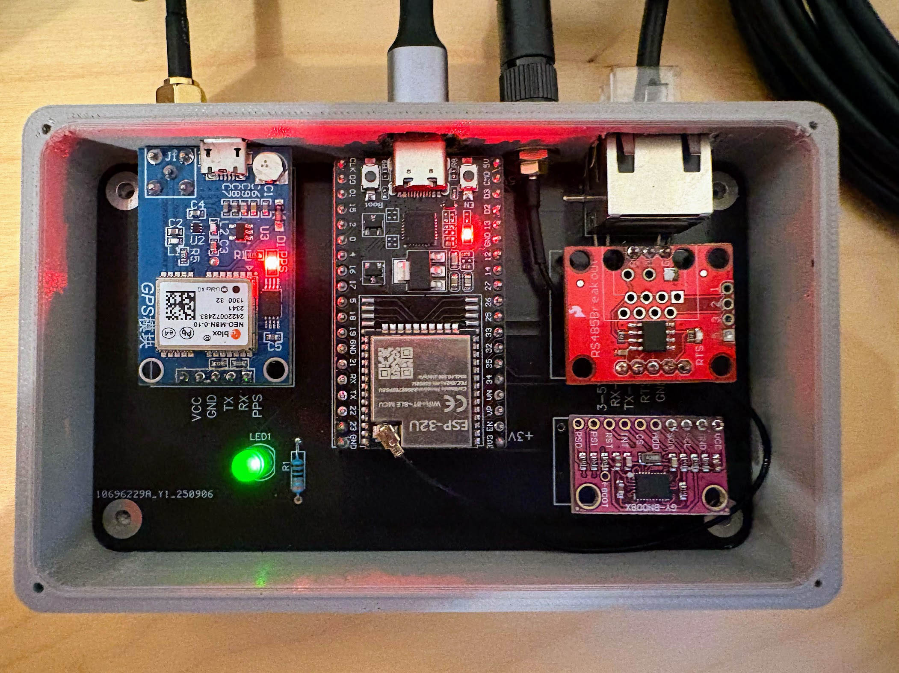

# Veetr PCB Files

This directory contains the PCB design files for the Veetr ESP32 breakout board.

## Modular Design Philosophy

Veetr uses a **modular breakout board design** with standard off-the-shelf sensors for maximum flexibility and repairability.

**📋 Full Details**: [Hardware Guide](../docs/HARDWARE.md)

## Design Files

The complete PCB and schematic design is available on EasyEDA (OSHWLab):

**🔗 [Veetr Breakout Board on EasyEDA](https://oshwlab.com/linhartescope/esp32-breakout-board)**

This project includes:
- Complete schematic design
- PCB layout with component placement
- Bill of Materials (BOM)
- 3D preview of the assembled board

The design can be opened, edited, and customized directly in EasyEDA's web-based editor. You can also fork the project to create your own variations. **Contributions and improvements are welcome!**

## Manufacturing Files

### Gerber Files (`gerbers/`)
Generated on: 2025-09-06

Contains standard Gerber files for PCB fabrication:
- `Gerber_TopLayer.GTL` - Top copper layer
- `Gerber_BottomLayer.GBL` - Bottom copper layer  
- `Gerber_TopSilkscreenLayer.GTO` - Top silkscreen
- `Gerber_BottomSilkscreenLayer.GBO` - Bottom silkscreen
- `Gerber_TopSolderMaskLayer.GTS` - Top solder mask
- `Gerber_BottomSolderMaskLayer.GBS` - Bottom solder mask
- `Gerber_BoardOutlineLayer.GKO` - Board outline
- `Gerber_DocumentLayer.GDL` - Documentation layer
- `Drill_PTH_Through.DRL` - Plated through holes
- `Drill_PTH_Through_Via.DRL` - Via holes
- `Drill_NPTH_Through.DRL` - Non-plated through holes

## PCB Specifications

- **Board Size**: TBD
- **Layers**: 2-layer PCB
- **Thickness**: 1.6mm (standard)
- **Material**: FR4
- **Finish**: HASL (Hot Air Solder Leveling) or ENIG
- **Min Trace Width**: 0.1mm
- **Min Via Size**: 0.2mm

## Manufacturing Notes

See https://docs.easyeda.com/en/PCB/Order-PCB for specific ordering instructions and requirements.

### Recommended PCB Manufacturers
- **JLCPCB** - Cost-effective for prototypes and small runs
- **PCBWay** - Good quality and service
- **OSH Park** - USA-based, high quality
- **AISLER** - Europe-based

## License

This PCB design is released under the same MIT license as the rest of the Veetr project.